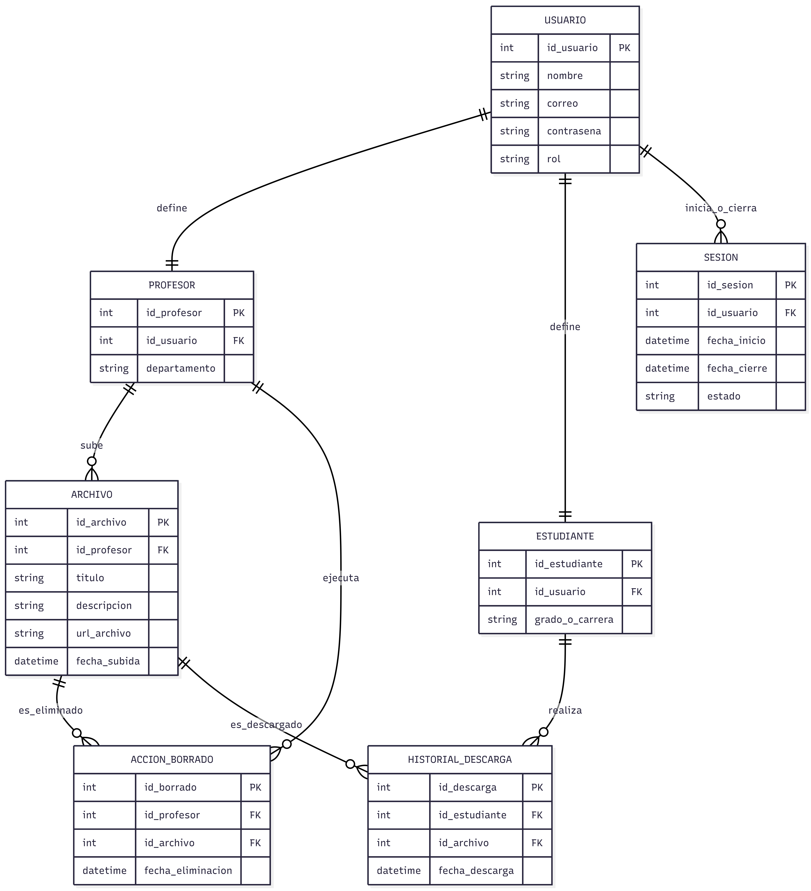

# Documento de Diseño: Base de Datos de Seguimiento Académico

---

##  Alcance

La base de datos para el proyecto incluye todas las entidades necesarias para facilitar el proceso de seguimiento del progreso de los estudiantes y dejar comentarios sobre el trabajo de los estudiantes. Como tal, se incluye en el alcance de la base de datos:

* **Estudiantes:** Incluye información básica de identificación.
* **Instructores:** Incluye información básica de identificación.
* **Entregas de estudiantes:** Incluye el momento en que se realizó la entrega, la puntuación de corrección que recibió y el problema al que está relacionada la entrega.
* **Problemas:** Incluye información básica sobre los problemas del curso.
* **Comentarios de los instructores:** Incluye el contenido del comentario y la entrega sobre la que se dejó el comentario.

>  **Fuera del alcance:** Quedan fuera del alcance elementos como certificados, calificaciones finales y otros atributos no esenciales.

---

##  Requisitos Funcionales

Esta base de datos soportará:

* Operaciones **CRUD** para estudiantes e instructores.
* Seguimiento de todas las versiones de las entregas de los estudiantes, incluyendo múltiples entregas para el mismo problema.
* Agregar múltiples comentarios a una entrega de un estudiante por parte de los instructores.

 *Tengan en cuenta que en esta iteración, el sistema no soportará que los estudiantes respondan a los comentarios.*

---

## 📊 Representación

Las entidades se capturan en tablas de **SQLite** con el siguiente esquema.

### Entidades

#### 1. Estudiantes (`students`)

| Columna | Tipo de Dato | Restricciones / Descripción |
| :--- | :--- | :--- |
| `id` | `INTEGER` | `PRIMARY KEY` — ID único para el estudiante. |
| `first_name` | `TEXT` | Nombre del estudiante. |
| `last_name` | `TEXT` | Apellido del estudiante. |
| `github_username` | `TEXT` | `UNIQUE` — Nombre de usuario de GitHub (único por estudiante). |
| `started` | `NUMERIC` | `DEFAULT CURRENT_TIMESTAMP` — Fecha y hora en que inició el curso. |

#### 2. Instructores (`instructors`)

| Columna | Tipo de Dato | Restricciones / Descripción |
| :--- | :--- | :--- |
| `id` | `INTEGER` | `PRIMARY KEY` — ID único para el instructor. |
| `first_name` | `TEXT` | `NOT NULL` — Nombre del instructor. |
| `last_name` | `TEXT` | `NOT NULL` — Apellido del instructor. |

#### 3. Problemas (`problems`)

| Columna | Tipo de Dato | Restricciones / Descripción |
| :--- | :--- | :--- |
| `id` | `INTEGER` | `PRIMARY KEY` — ID único para el problema. |
| `problem_set` | `INTEGER` | `NOT NULL` — Número del conjunto de problemas al que pertenece. |
| `name` | `TEXT` | `NOT NULL` — Nombre del conjunto de problemas. |

#### 4. Entregas (`submissions`)

| Columna | Tipo de Dato | Restricciones / Descripción |
| :--- | :--- | :--- |
| `id` | `INTEGER` | `PRIMARY KEY` — ID único para la entrega. |
| `student_id` | `INTEGER` | `FOREIGN KEY(students.id)`, `NOT NULL` — Estudiante que entrega. |
| `problem_id` | `INTEGER` | `FOREIGN KEY(problems.id)`, `NOT NULL` — Problema resuelto. |
| `submission_path` | `TEXT` | `NOT NULL` — Ruta relativa de archivos en el servidor. |
| `correctness` | `NUMERIC` | `NOT NULL`, `CHECK(correctness > 0 AND correctness <= 1.0)` — Puntuación (0 a 1.0). |
| `timestamp` | `NUMERIC` | `NOT NULL`, `DEFAULT CURRENT_TIMESTAMP` — Fecha y hora de la entrega. |

#### 5. Comentarios (`comments`)

| Columna | Tipo de Dato | Restricciones / Descripción |
| :--- | :--- | :--- |
| `id` | `INTEGER` | `PRIMARY KEY` — ID único para el comentario. |
| `instructor_id` | `INTEGER` | `FOREIGN KEY(instructors.id)`, `NOT NULL` — Autor del comentario. |
| `submission_id` | `INTEGER` | `FOREIGN KEY(submissions.id)`, `NOT NULL` — Entrega comentada. |
| `contents` | `TEXT` | `NOT NULL` — Texto y contenido del comentario. |

---

### Relaciones

El siguiente diagrama de entidad-relación describe las relaciones entre las entidades en la base de datos:

![Diagrama Entidad-Relación]

Como se detalla en el diagrama:

* **Estudiante ↔ Entrega (1:N):** Un estudiante es capaz de hacer de `0` a muchas entregas. Una entrega es realizada por uno y solo un estudiante *(entregas individuales)*.
* **Problema ↔ Entrega (1:N):** Una entrega está asociada con uno y solo un problema. Un problema puede tener de `0` a muchas entregas.
* **Entrega ↔ Comentario (1:N):** Un comentario está asociado con una y solo una entrega. Una entrega puede tener de `0` a muchos comentarios.
* **Instructor ↔ Comentario (1:N):** Un comentario es escrito por uno y solo un instructor. Un instructor puede escribir de `0` a muchos comentarios.

---

##  Optimizaciones

Según las consultas típicas en `queries.sql`:
1. **Identificación de Estudiantes:** Se crean índices en las columnas `first_name`, `last_name` y `github_username` para acelerar las búsquedas de entregas por estudiante.
2. **Búsqueda por Problema:** Se crea un índice en la columna `name` en la tabla `problems` para acelerar la identificación de problemas por nombre.

---

##  Limitaciones

El esquema actual asume **entregas individuales**. Las entregas colaborativas o en grupo requerirían modificar la estructura hacia una relación de muchos a muchos (M:N) entre estudiantes y entregas mediante una tabla intermedia.